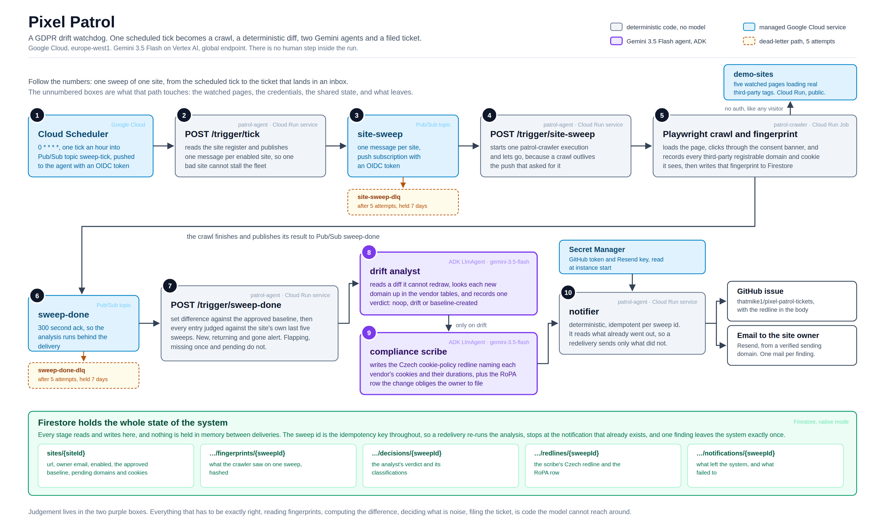

# Pixel Patrol

A GDPR drift watchdog that runs itself. Once an hour it crawls the sites it is
responsible for, fingerprints every third-party host and cookie they load, and compares
that against the baseline someone approved. When a tracker appears that nobody decided to
add, two Gemini agents work out what it is and what the site's cookie policy now has to
say, and the system opens a GitHub issue and emails the site owner with a Czech redline
and a RoPA row ready to file. There is no human step anywhere inside that sequence, and no
dashboard to check: the first a person hears about it is the ticket.

Built for the All Things Agentic hackathon (Taskmaster track) on Gemini 3.5 Flash, Google
ADK and Google Cloud.

**Live pages the watchdog is pointed at: https://demo-sites-b2xhora5ka-ew.a.run.app/**

Those five pages are served by this repo and watched by this system. Four of them can be
made to drift; the fifth loads four real trackers and must never alert.

## Architecture



<sub>Source: [docs/architecture.svg](docs/architecture.svg)</sub>

The division of labour is the design. Everything that has to be exactly right is
deterministic code the model cannot reach around: reading fingerprints, computing the set
difference, deciding what counts as noise, deduplicating a finding, filing the ticket. The
two Gemini agents do the part that is actually judgement. The drift analyst decides
whether a difference is a first sweep, harmless ad-tech rotation, or a tracker that
appeared without anyone deciding to add it, and it names a vendor only when the tables
ground one. The compliance scribe writes the Czech redline and the RoPA row, which is
document drafting and not something a template does well.

An LLM asked to eyeball two host lists will occasionally miss one, and a missed marketing
pixel is the exact failure this product exists to prevent. So the model never does the
diffing.

### The stability window

A raw set difference is not an alert. On a commercial site the third-party domain set
moves between sweeps on its own, because a programmatic ad slot fills with a different
vendor on every pageview. An agent that alerts on that gets muted in a week, and a muted
watchdog is worse than none.

Every domain and cookie is therefore classified against the site's own recent history
before anything is reported. A domain absent from the baseline and from all of the last
N=5 sweeps has genuinely never been seen here, so it alerts. One that flickers in and out
across that window is rotation, so it does not. A baseline entry has to be missing from
M=3 consecutive sweeps before its disappearance counts as a removal, because one bad
pageview is not a removal. Measured over 69 real decisions on
a Czech news site: 643 differences seen, 12 reported, no domain reported twice. The
numbers and how they were arrived at are in [docs/stability-tuning.md](docs/stability-tuning.md).

## Spin up from zero

Prerequisites: `gcloud` authenticated as an account that owns a billing account, Node 22
or newer, `jq`, and Docker only if you want to build locally (the deploys build with Cloud
Build).

```bash
git clone https://github.com/<owner>/pixel-patrol && cd pixel-patrol
npm install

# 1. project, identities, permissions, Firestore, topics, secrets, Artifact Registry.
#    idempotent, and it ends with a live gemini-3.5-flash call, so a clean exit means
#    the project is actually ready.
# BILLING_ACCOUNT is the ACCOUNT_ID column of `gcloud billing accounts list`
PROJECT_ID=<your-project> BILLING_ACCOUNT=XXXXXX-XXXXXX-XXXXXX ./infra/provision.sh

gcloud auth application-default login   # once, for the local scripts

# 2. the crawler job first: the agent starts it, so it has to exist
PROJECT_ID=<your-project> ./infra/deploy-crawler.sh

# 3. the agent. prints an ADMIN_KEY once on a fresh project. store it.
PROJECT_ID=<your-project> ./infra/deploy-agent.sh

# 4. topics, push subscriptions, dead-letter wiring, hourly scheduler
PROJECT_ID=<your-project> ./infra/wire-pubsub.sh

# 5. the five demo pages, on their own zero-privilege service account
PROJECT_ID=<your-project> ./infra/deploy-demo-sites.sh

# 6. the one alert: something is parked in a dead-letter queue
PROJECT_ID=<your-project> ALERT_EMAIL=you@example.com ./infra/wire-alerts.sh
```

That is a working watchdog: it crawls, diffs, analyses and records. To make it file
tickets and send mail, give it the two credentials. `provision.sh` creates both secrets
empty, and an empty value reads back as "no credential", so the notifier stays dormant
until you add a real version and skips only the half it is missing.

```bash
# a GitHub PAT with issues:write on the repo tickets should be filed against
printf '%s' "<token>" | gcloud secrets versions add github-tickets-token --data-file=-
# a Resend API key, sending from a domain Resend has verified
printf '%s' "<key>"   | gcloud secrets versions add resend-api-key --data-file=-
```

`:latest` is resolved when an instance starts, so no redeploy is needed. Then point it at
something. `PROJECT_ID` and the demo base URL come from the deploy output:

```bash
export ADMIN_KEY=<the key deploy-agent printed>
AGENT_URL=$(gcloud run services describe patrol-agent --region europe-west1 \
  --project <your-project> --format='value(status.url)')
PAGES_URL=$(gcloud run services describe demo-sites --region europe-west1 \
  --project <your-project> --format='value(status.url)')

for s in boutique magazine clinic bistro atelier; do
  curl -sS -X POST "${AGENT_URL}/sites" \
    -H "Authorization: Bearer $(gcloud auth print-identity-token)" \
    -H "x-admin-key: ${ADMIN_KEY}" -H 'content-type: application/json' \
    -d "{\"siteId\":\"demo-${s}\",\"url\":\"${PAGES_URL}/${s}/\",\"ownerEmail\":\"you@example.com\"}"
done
```

The first sweep of a new site records `baseline-created` and approves itself. From the
second sweep on, it is watching. The scheduler fires hourly on its own; to force one:

```bash
curl -sS -X POST "${AGENT_URL}/sites/demo-boutique/sweep" \
  -H "Authorization: Bearer $(gcloud auth print-identity-token)" \
  -H "x-admin-key: ${ADMIN_KEY}" -H 'content-type: application/json' -d '{}'
```

Two notes that cost real time to learn. `patrol-agent` is deployed
`--no-allow-unauthenticated`, so every operator call needs both a Google identity token
and the admin key. And `gemini-3.5-flash` is served only on the Vertex `global` location,
while everything else lives in `europe-west1`; the scripts already set this, but a
hand-written client pointed at a regional Vertex endpoint will fail with a confusing
404.

## Making it drift

[docs/demo-runbook.md](docs/demo-runbook.md) is the copy-paste version, with the expected
verdict for each shape. In short, each demo page carries its drift inline between marker
comments and is toggled by commenting the payload in or out:

```bash
npm --prefix demo-sites run drift -- status
npm --prefix demo-sites run drift -- induce boutique-pixel   # a Meta Pixel appears
PROJECT_ID=<your-project> ./infra/deploy-demo-sites.sh       # nothing is live until this
npm --prefix demo-sites run drift -- reset                   # all pages back to baseline
```

The edit is a real edit to a real page this project serves, so the claim "a marketer added
a tracking pixel and the watchdog opened a ticket" is the literal sequence of events, with
no planted history.

## Tests

135 tests, no framework, `node --test` with `tsx` as the loader.

```bash
npm test        # all four workspaces
npm run typecheck
```

They cover the parts where being wrong is expensive: the diff kernel and the stability
classification, the vendor lookup (including the near-match bug that once made the model
name Mailchimp as the operator of a Czech hit counter), push message decoding and the
malformed-request contract over a real socket, notifier idempotency asserted at the
`fetch` boundary so request bodies are actually checked, and path containment in the
static server.

## Repo layout

| path | what is in it |
| --- | --- |
| `agent/` | the `patrol-agent` Cloud Run service: push routes, the analyst and scribe `LlmAgent`s and their tools, the notifier, Firestore access |
| `crawler/` | the `patrol-crawler` Cloud Run Job: Playwright crawl, consent bypass, fingerprint and Pub/Sub sinks |
| `shared/` | what both sides must agree on: fingerprint types and hash, the diff kernel, the stability window, the vendor and cookie tables |
| `demo-sites/` | the five watched pages, their static server, and the drift switches |
| `infra/` | provision, deploy and wiring scripts, Cloud Build configs |
| `docs/` | the documents below |

| document | what it answers |
| --- | --- |
| [docs/demo-runbook.md](docs/demo-runbook.md) | how to run the demo, and what each shape should say |
| [docs/stability-tuning.md](docs/stability-tuning.md) | why N=5 and M=3, measured against real ad-tech churn |
| [docs/dlq-verification.md](docs/dlq-verification.md) | what happens to a poison message, verified end to end |
| [docs/iam.md](docs/iam.md) | every grant in the project and why it is the narrowest one that works |
| [docs/architecture.svg](docs/architecture.svg) | the diagram above |
| [LIFTED.md](LIFTED.md) | the pre-existing code disclosure the hackathon rules require |

## Stack

Gemini 3.5 Flash on Vertex AI (`global`), Google ADK (`LlmAgent` with `FunctionTool`s),
Cloud Run services and a Cloud Run Job, Pub/Sub with dead-letter topics and pull
subscriptions on both, Firestore in native mode, Cloud Scheduler, Secret Manager, Cloud
Build and Artifact Registry. TypeScript on Node 22 throughout, in npm workspaces so the
fingerprint types exist exactly once.
